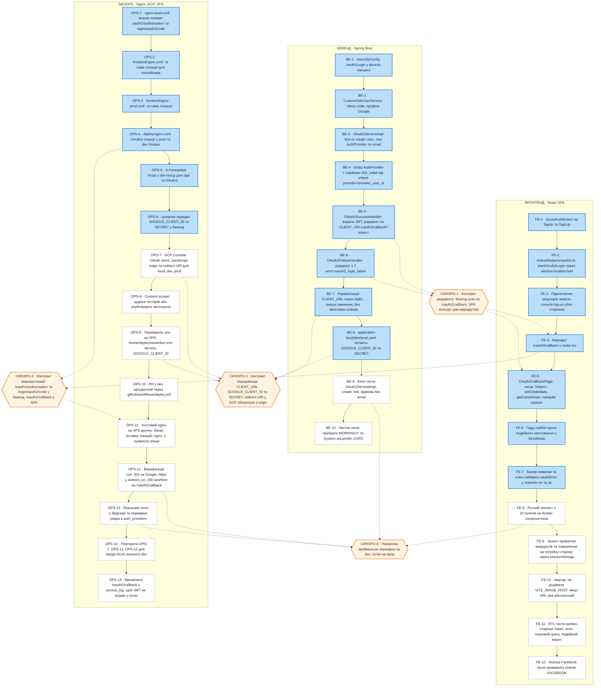

# TFB-010 — Google OAuth2.0: блок-схема флоу розробки

**Репозиторій:** github.com/Dzheva/bookamore · **Гілка:** `TFB-010-oauth2-callback-and-nginx` · **Коміт:** `cc1f029` · **Дата:** 02.08.2026

Легенда кольорів:

| Позначення | Значення |
|---|---|
| 🟦 блакитний фон | вже реалізовано в коді гілки `cc1f029` (перевірено по файлах) |
| ⬜ звичайний фон | ще треба зробити (деплой, конфігурація середовищ, беклог) |

---

## 1. Схема флоу розробки (три доріжки + точки взаємодії)

---

## 2. Рантайм-флоу (що відбувається під час логіну)

Усі блоки цього ланцюга вже реалізовані в коді — не працюють вони лише там, де ще не виконані кроки DevOps-доріжки (OPS-7…OPS-14).

```mermaid
flowchart LR
    classDef done fill:#BBDEFB,stroke:#1976D2,stroke-width:2px,color:#0D2B45
    classDef ext fill:#F5F5F5,stroke:#616161,stroke-width:1px,color:#212121

    R1["1 · Браузер: клік Continue with Google, повний перехід на /oauth2/authorization/google"]
    R2["2 · Nginx: локація збігається, проксі у бекенд, а не у SPA"]
    R3["3 · Spring: редирект на consent screen, redirect_uri = origin + /login/oauth2/code/google"]
    R4["4 · Google: автентифікація та згода користувача"]
    R5["5 · Бекенд: CustomOidcUserService міняє code на профіль, OAuth2ServiceImpl шукає або створює User та AuthProvider"]
    R6["6 · OAuth2SuccessHandler: видає власний JWT, редирект на CLIENT_URL/oauth2/callback?token="]
    R7["7 · SPA: OAuth2CallbackPage кладе токен у store та localStorage, тягне current-user, веде на /"]

    R1 --> R2 --> R3 --> R4 --> R5 --> R6 --> R7

    class R1,R2,R3,R5,R6,R7 done
    class R4 ext
```

Ключовий наслідок: токен приїжджає **query-параметром після повного перезавантаження сторінки**, а не JSON-відповіддю. Redux-стан на цей момент порожній, переживає навігацію лише `localStorage` — тому колбек-сторінка першою дією робить `setCredentials`.

---

## 3. Таблиця блоків: ФРОНТЕНД

| ID | Блок | Файл / артефакт | Статус |
|---|---|---|---|
| FE-1 | `SocialAuthButton` намальована й вставлена на обидві сторінки | `pages/SignInPage`, `pages/SignUpPage` | 🟦 готово (було до тікета) |
| FE-2 | Хелпер `startOAuth2Login(provider)` — редирект через `window.location.href` | `src/shared/helpers/oauth2.ts` | 🟦 готово |
| FE-3 | Підключення хелпера замість `console.log('Google auth')` | `SignInPage.tsx`, `SignUpPage.tsx` | 🟦 готово |
| FE-4 | Маршрут `/oauth2/callback` | `src/app/router/router.tsx:67` | 🟦 готово |
| FE-5 | `OAuth2CallbackPage`: `?token=` → `setCredentials` → `getCurrentUser` → `navigate('/', {replace:true})` | `src/pages/OAuth2CallbackPage/OAuth2CallbackPage.tsx` | 🟦 готово |
| FE-6 | Гард `useRef(isHandled)` проти подвійного ефекту у StrictMode | там само | 🟦 готово |
| FE-7 | Гілка помилки: `?error=` → `/sign-in` з банером, ключ `validation.oauthError` в `en` та `uk` | `public/locales/{en,uk}/translation.json` | 🟦 готово |
| FE-8 | Прогнати ручний чеклист із 10 пунктів на `docker-compose-local.yaml` | розділ 3.3 фронтенд-гайду | ⬜ треба зробити |
| FE-9 | Захист приватних маршрутів + повернення на цільову сторінку через `sessionStorage` | окремий TFF | ⬜ треба зробити |
| FE-10 | Аватар Google: не префіксувати `VITE_IMAGE_HOST`, якщо URL уже абсолютний | компоненти аватара | ⬜ треба зробити |
| FE-11 | RTL-тести колбека: token / error / порожній query / подвійний маунт | тести відсутні | ⬜ треба зробити |
| FE-12 | Кнопка Facebook (бекенд уже підтримує `ProviderType.FACEBOOK`) | окремий TFF, після OPS | ⬜ треба зробити |

**Два неочевидні рішення, зафіксовані в коді:** не `VITE_BASE_API_URL` (OAuth-ендпойнти живуть у корені бекенду, а не під `/api/v1` — з префіксом буде 404) і не `fetch`/RTK Query (це ланцюг браузерних редиректів; XHR заблокує CSP Google).

---

## 4. Таблиця блоків: БЕКЕНД

| ID | Блок | Файл | Статус |
|---|---|---|---|
| BE-1 | `oauth2Login` у фільтр-ланцюгу | `config/SecurityConfig.java` | 🟦 готово (було до тікета) |
| BE-2 | OIDC-сервіс — шлях, яким реально йде Google | `service/CustomOidcUserService.java` | 🟦 готово (було) |
| BE-3 | Find-or-create користувача, лінк провайдера по email, оновлення імені й аватара | `service/impl/OAuth2ServiceImpl.java` | 🟦 готово (було) |
| BE-4 | Сутність + схема, unique `provider` + `provider_user_id` | `entity/AuthProvider.java`, `db/changelog/changes/001_initial.sql` | 🟦 готово (було) |
| BE-5 | **Фікс:** редирект на `/oauth2/callback` замість неіснуючого `/login` + видача JWT | `handler/OAuth2SuccessHandler.java` | 🟦 готово (цей тікет) |
| BE-6 | **Фікс:** те саме для помилки, `?error=oauth2_login_failed`, лог рівня `warn` | `handler/OAuth2FailureHandler.java` | 🟦 готово (цей тікет) |
| BE-7 | **Фікс:** нормалізація `CLIENT_URL` через SpEL — перше значення зі списку, без хвостових слешів | обидва хендлери | 🟦 готово (цей тікет) |
| BE-8 | Читання `GOOGLE_CLIENT_ID` / `GOOGLE_CLIENT_SECRET` у трьох профілях | `application-{local,dev,prod}.yaml` | 🟦 готово (було) |
| BE-9 | Юніт-тести `OAuth2ServiceImpl`: створення, лінк до наявного email, відмова без email | тестів немає | ⬜ треба зробити |
| BE-10 | Чистка логування: `!!!`-логи, `System.out.println` CORS у `SecurityConfig.java:76`, лог повного `OAuth2User` з PII | окремий тікет | ⬜ треба зробити |

**Чому раніше флоу не завершувався:** редирект вів на `/login`, якого немає в SPA (є `/sign-in`); `CLIENT_URL` — це водночас comma-separated CORS-список, тож редирект будувався як `http://localhost:3000,https://bookamore.alt-web.biz.ua/login?token=…`.

---

## 5. Таблиця блоків: DEVOPS

| ID | Блок | Де | Статус |
|---|---|---|---|
| OPS-1 | Вузька локація `^/(oauth2/authorization\|login/oauth2/code)/` | `nginx-local.conf:51` | 🟦 готово |
| OPS-2 | Та сама локація для контейнера фронтенду | `frontend/nginx.conf:29` | 🟦 готово |
| OPS-3 | Та сама локація у prod-образі | `frontend/nginx-prod.conf:43` | 🟦 готово |
| OPS-4 | OAuth2-локації у prod- та dev-блоках хостового конфігу **в репозиторії** | `deploy/nginx.conf:46, :88` | 🟦 готово |
| OPS-5 | `X-Forwarded-Proto $scheme` у dev-блоці (`/api/` + OAuth2) | `deploy/nginx.conf` | 🟦 готово |
| OPS-6 | Compose передає `GOOGLE_CLIENT_ID` / `GOOGLE_CLIENT_SECRET` у бекенд | `docker-compose.yaml`, `docker-compose.dev.yml` | 🟦 готово (було) |
| OPS-7 | GCP Console: OAuth client типу Web application, JavaScript origin + redirect URI для local / dev / prod | Google Cloud Console | ⬜ треба зробити |
| OPS-8 | Consent screen: у статусі Testing додати тестерів, інакше `access_denied`; або опублікувати | Google Cloud Console | ⬜ треба зробити |
| OPS-9 | **Крок 0, до мержу:** перевірити `.env` на VPS — `application-dev.yaml` читає `${GOOGLE_CLIENT_ID}` без дефолту, нерозв'язаний плейсхолдер валить старт Spring цілком | `/home/deploy/www/dev/.env` | ⬜ треба зробити |
| OPS-10 | PR у `dev`, автодеплой `.github/workflows/deploy.yml` (git pull + `docker compose up -d --build`) | GitHub | ⬜ треба зробити |
| OPS-11 | **Ручний крок:** застосувати локації на хостовому nginx VPS — бекап, вставка, `nginx -t`, `systemctl reload` (не restart) | VPS | ⬜ треба зробити |
| OPS-12 | Верифікація `curl`: 302 на Google, `https` у `redirect_uri`, 200 `text/html` на `/oauth2/callback` | VPS / локально | ⬜ треба зробити |
| OPS-13 | Реальний логін у браузері + перевірка рядка в `auth_providers` через `psql` | dev-контур | ⬜ треба зробити |
| OPS-14 | Після зеленого dev — PR `dev → main`, повторити OPS-7, OPS-11, OPS-12 для прода | прод | ⬜ треба зробити |
| OPS-15 | Виключити `/oauth2/callback` з `access_log` — JWT їде в query-параметрі | хостовий nginx | ⬜ треба зробити |

### Redirect URI для реєстрації в GCP (OPS-7)

| Середовище | Authorized JavaScript origin | Authorized redirect URI |
|---|---|---|
| Local Docker | `http://localhost:8080` | `http://localhost:8080/login/oauth2/code/google` |
| Dev | `https://bookamore-dev.alt-web.biz.ua` | `https://bookamore-dev.alt-web.biz.ua/login/oauth2/code/google` |
| Prod | `https://bookamore.alt-web.biz.ua` | `https://bookamore.alt-web.biz.ua/login/oauth2/code/google` |

Redirect URI — це дефолт Spring Security `{baseUrl}/login/oauth2/code/{registrationId}`; у YAML він не заданий, тож будується з вхідного запиту — саме тому критичний `X-Forwarded-Proto` (OPS-5).

---

## 6. Точки взаємодії доріжок

| # | Точка синхронізації | Хто з ким | Зміст контракту | Ціна помилки |
|---|---|---|---|---|
| СИНХРО-1 | Контракт редиректу | BE-5, BE-6 → FE-4, FE-5 | Бекенд редіректить на `{CLIENT_URL}/oauth2/callback?token=` або `?error=`; цим маршрутом володіє SPA | Успішний логін падає у 404 (саме так і було з `/login`) |
| СИНХРО-2 | Контракт маршрутизації | FE-4, OPS-4 → OPS-11 | `/oauth2/authorization/*` і `/login/oauth2/code/*` — у бекенд; `/oauth2/callback` — у SPA. Патерн не розширювати назад до `^/(login/)?oauth2/` | Широкий regex проковтне колбек SPA: замість сторінки — 401 з бекенду, тихо ламається кожен успішний логін |
| СИНХРО-3 | Контракт середовища | BE-7, BE-8, OPS-7, OPS-9 | `CLIENT_URL` = origin, з якого реально ходить браузер (перший у списку); `GOOGLE_*` заведені; той самий origin зареєстрований у GCP | `redirect_uri_mismatch`, CORS-помилки, або взагалі неможливий старт Spring |
| СИНХРО-4 | Приймальна перевірка | FE-8, BE-9, OPS-12, OPS-13 | Спершу зелений dev, лише потім прод | Дефект їде одразу на прод |

---

## 7. Пастки, зафіксовані емпірично

| Пастка | Прояв | Що робити |
|---|---|---|
| `.env` перебиває `docker-compose` | `EnvConfig.loadEnv()` робить `System.setProperty()`, а `systemProperties` у Spring старші за `systemEnvironment`, яким compose передає `environment:`. У локальному стеку бекенд редіректив би на dev-хост замість `localhost:8080` | Правити `CLIENT_URL` саме в `backend/src/main/resources/.env` |
| Заглушки замість ключів | `GOOGLE_CLIENT_ID` довжиною 9 символів — це `change_me` з `.env.example`; справжній має вигляд `…apps.googleusercontent.com` (~72 символи) | Вставити реальні ключі з GCP |
| `npm run dev` не годиться для OAuth | Vite проксює лише `/api/v1`, решту віддає React Router → 404; та й Google не редіректить на незареєстрований origin | Тестувати через `docker compose -f docker-compose-local.yaml up --build`, відкривати `http://localhost:8080/sign-in`, не `:3000` |
| Дубльовані env у `docker-compose.yaml:40-47` | Поруч `GOOGLE_CLIENT_ID` і `SPRING_SECURITY_OAUTH2_CLIENT_REGISTRATION_GOOGLE_CLIENT_ID`; читається перша, але друга через relaxed binding тихо переможе, якщо задати їй інше значення | Не задавати обидві різними значеннями; прибрати окремим тікетом |
| JWT у query-параметрі | Токен осідає в історії браузера, `access_log` nginx і логах проміжних проксі | Тимчасово — OPS-15; повне рішення (HttpOnly-cookie або одноразовий код обміну) винести в архітектурний тікет до публічного запуску |

---

## 8. Що вже перевірено на гілці

- `./mvnw -DskipTests compile` на JDK 17 — успішно.
- Spring-контекст піднято проти одноразового PostgreSQL 16 з `CLIENT_URL=http://localhost:3000/,https://bookamore.alt-web.biz.ua` — `Tests run: 1, Failures: 0, Errors: 0` (перевіряє нові SpEL-вирази в рантаймі, чого компіляція не робить).
- SpEL обчислено окремо на чотирьох формах `CLIENT_URL`.
- Усі чотири nginx-конфіги проходять `nginx -t`; маршрутизацію перевірено живим nginx зі стабами.
- `npm run build` і `npm run lint` — чисто.
- Відоме передіснуюче: `./mvnw test` без Docker падає на `contextLoads` (`UnknownHostException: bookamore-db`) — ідентично на чистому `main`.
